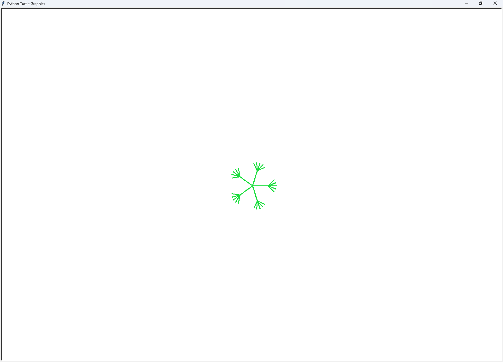
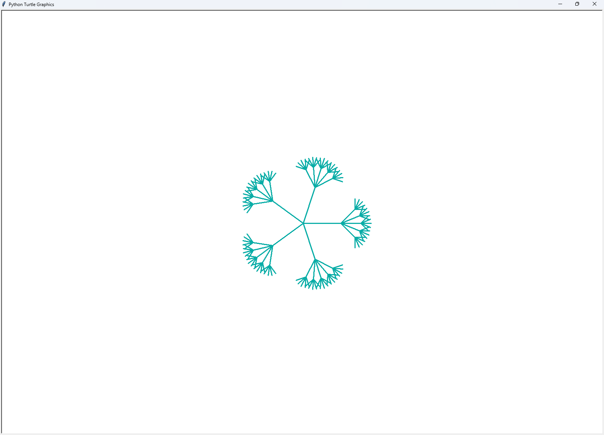
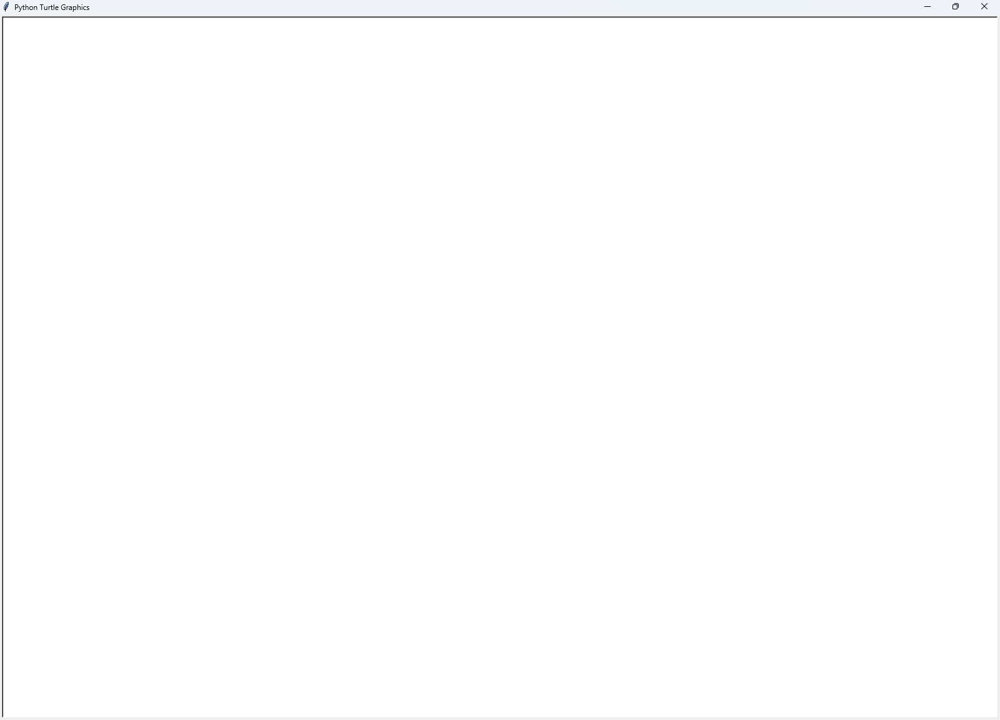
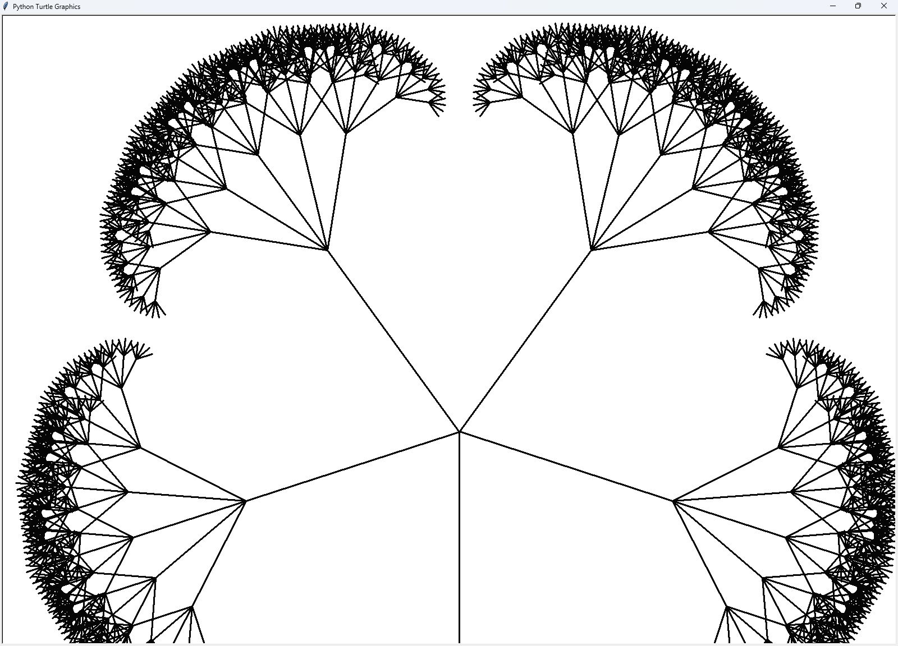

# Recursive Fractal Generator
When you first run the program, it will be a blank canvas. Nothing will happen until you spawn something with an input.

## Note on Performance
Due to there being too many configurable settings, it is impractical to list the limits for every scenario. Where applicable, a range will be given as a guideline. However, going past it may not always cause issues, depending on your other settings and the number of balls.

The program should still run no matter the state, but making them too high may cause low frame rate or freezes. This is because with higher settings or too many balls, there are a lot of lines that need to be rendered, which can take a long time.

# Usage
## Inputs
### Spawning a fractal ball
Spawn a fractal ball by simply putting a number in the input. This number will be the length of the first branch.
```
Input: 50
```

### Configuring settings
You can change the settings by typing its name (case-insensitive) followed by the value. All settings are numbers, with decimals supported (note that some settings will truncate the decimals)

For example, the following input will set the speed to 2:
```
Input: speed 2
```

All of the following settings are available to be changed:
- Max FPS
- Speed
- Width
- Branch angle range
- Branches
- Min branch length
- Decline rate

__Max FPS__\
This is simply a cap on FPS, and does not actually change the performance. This is meant to prevent fluctuations in FPS when changing settings

__Speed__\
This a multiplier to the vector, and does not impact the performance

__Width__\
This defines the width of the stroke, and makes no impact to the radius of the balls. It should not make a noticeable impact to performance

__Branch angle range__\
This is the total angle that the child branches will span. It should not make a noticeable impact to performance

__Branches__\
This defines how many branches will grow at each layer. This makes a big impact on performance. It is recommended to keep this value from 2-5.

__Min branch length__\
This is the minimum branch length before it stops branching out. It is recommended to keep this value from 20-50

__Decline rate__\
This is the rate at which the branch length will decline by. For example if the rate is 2, the length of the child branches will be 1/2 of their parent branch. It is recommended to keep this value from 1.7-3

## Outputs
When pressing enter, either with an input or without, the program will display 2 pieces of information.

- The total number of recursive calls that have been made in the lifetime
- The current FPS

# Description of code
## Fractal Balls
The each fractal ball is an instance of a `Ball` class, which is added to the `balls` list.

### Fields
There is a field for each of the following attributes, with the following types
- Position (`pos`): [x: float, y: float, rotation: float]
- Radius: float
- Vector: [x: float, y: float, rotation: float]
- Colour: [r: float, g: float, b: float]
- Total length (`totalLength`): float

### Methods
__Constructor__\
The constructor creates a ball with the arguments passed into it.

__draw and drawBranch__\
`draw` is the method that is meant to be called. It is called each loop, and uses `drawBranch` for every direction to create a ball. It only requires the turtle that it shoudl use to draw. All other required values are taken from the `SETTINGS` dictionary. `drawBranch` is the recursive function that calls itself.

__Getters and Setters__\
There are various getter and setter methods that are used in the main loop, primarily to handle collision with the walls.

## Functions
### Spawning balls
__spawnBall__
This is the primary function that is used to spawn new balls. It creates a ball using the `Ball` constructor, assigns it a random vector, and appends it to the ball list. It takes in the radius as a required argument, and the position and vector as optional arguments.

### Handling Input
__handleInput__\
This function handles the text that the user inputs. This will be further discussed in a later section.

## Main Loop
This loop only runs the relevant code at a maximum of the specified max FPS. It does this by checking the current time and comparing it with the last run time. If it is running too early, it continues looping and skips the main code.

This loop clears the screen to prepare for drawing. It calls the `draw` method of each ball in the `balls` list. It also gets its current position, checks if it is out of bounds, and applies an opposing vector if it is. This is how the balls appear to bounce off the sides of the screen.

## Keyboard Thread
This program creates another thread which is used to obtain user input without blocking the main loop. When it receives input, it passes it to the given callback function. In this program, it is `handleInput`

## Special Turtle Usage
At the beginning of the program, it sets the turtle speed to max and removes the delay between actions. It also hides the turtle, so that only its strokes are visible. It also sets the tracer to 0, which disables the animations until updated. At the end of the main loop, the update function is called, causing the screen to update with the new drawing. This drastically improves performance, as it does not have to render the animation of each ball being drawn.

## Handling User Input
The user's input serves multiple purposes, so the program must distinguish what they are trying to do.

### Changing settings
The input is compared with each available setting. It checks if the input starts with the key of `SETTINGS` by lowering both strings and replacing the underscores ("_") with spaces in the key. If it matches, the program will take the entire string and use regex to remove any characters that are not a number or a decimal ("."). It then converts the resulting string to a float. The type conversion process is wrapped in a `try` block, which catches if the input is invalid. This usually only happens when there is more than one decimal place.

The branches setting requires an extra check, as the program will crash if it tries to generate only 1 branch.

If the input is valid, the value of the setting is changed to the inputted value, and the loop is stopped using `break`.

### Spawning balls
If every setting is iterated through and none match, the intent of the user is assumed to be to spawn a ball. This is meant to happen when the user inputs only a number with no text. A ball is spawned with an initial branch radius of the inputted number, clamped to the screen size. The type conversion process is wrapped in a `try` block, which catches if the input is invalid.

### Printing information
Regardless of if the user inputted text of not, a message will be displayed containing the total recursion count and current FPS. This will not be displayed if the user inputted text, but it was invalid for changing a setting or spawning a ball.

## Recursion
__`drawBranch` is the recursive function__

### Primary function
This method draws a branch by moving in the specified direction for the specified length.

It uses the `branch_angle_range` in the settings and the set number of `branches` to find the angle difference in between each branch. 

### Calling itself
The function iterates for the number of branches to draw all of the branches using the calculated angle difference. It also uses its current length, divided by the `decline_rate` in the settings.

### Base case
The recursion stops when the length becomes less than or equal to the `min_branch_length` in the settings.

### Return value
The return value is a tuple containing the recursion count and total length. The count is added to the `totalCount` variable. The total length is stored and used in collision calculations.

# Testing
## Input Validation and Handling
### Valid ball radius
__Input:__ `50`\
__Output:__ 

### Valid ball radius 2
__Input:__ `100`\
__Output:__ 

### Invalid ball radius
__Input:__ `0.5`\
__Output:__ `Invalid ball radius or setting name!` 

### Valid setting change
__Input:__ `speed 2`\
__Output:__ (No visible change in a screenshot, but the setting is changed) 

### Valid setting change (unknown characters)
__Input:__ `speed -2`\
__Output:__ (The minus character is ignored. No visible change in a screenshot, but the setting is changed) 

### Invalid setting change (invalid setting name)
__Input:__ `min fps 2`\
__Output:__ `Invalid ball radius or setting name!` 

### Invalid setting change (no value)
__Input:__ `speed `\
__Output:__ `Invalid setting value!` 

### Invalid setting change (invalid value)
__Input:__ `speed lorem`\
__Output:__ `Invalid setting value` 

### Invalid branch amount
__Input:__ `branches 1`\
__Output:__ `Branches must be at least 2!` 

### Invalid max FPS
__Input:__ `max fps 0`\
__Output:__ `Max FPS must be at least 1!` 

### Invalid decline rate
__Input:__ `decline rate 0`\
__Output:__ `Decline rate must be greater than 0!` 

### Ball radius too large
__Input:__ `9999999999`\
__Output:__ (A ball spawns, but its size is reduced to the screen size) 

# Problems encountered
The combination of iterating recursive functions caused many problems during development. Specifically, it was hard to make each iteration draw in a different direction for each loop. Part of this struggle was to figure out where the first branch should draw. This was made especially hard with the rapid movement and spinning, making it hard to locate the issue.

To solve this problem, it simply took a lot of refinement. The problem was isolated by temporarily disabling all movement, and slowing down the turtle. I then experimented with how different values behave to figure out what was the correct solution.